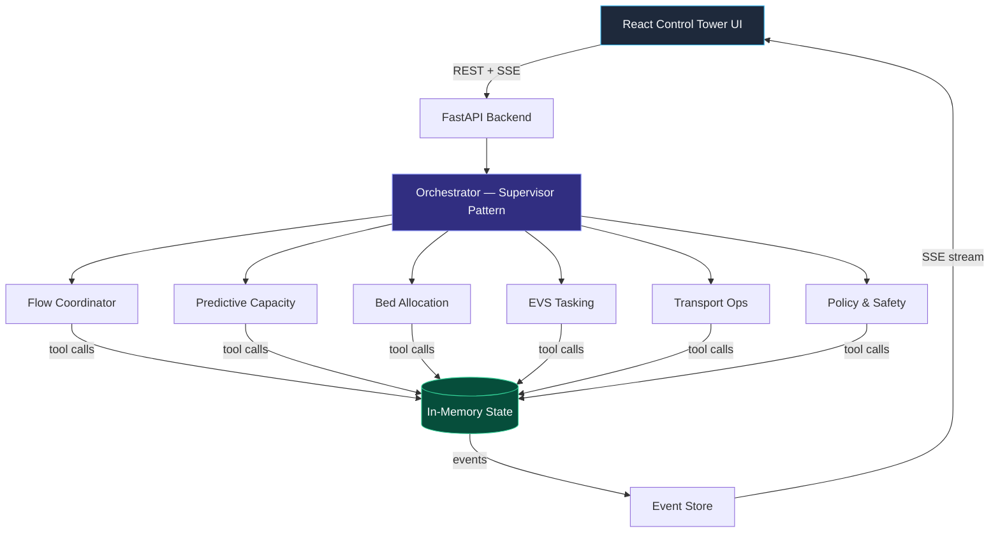

# Patient Flow / Bed Management — Agentic AI Demo

[](https://ai.azure.com/)
[](https://www.python.org/)
[](https://react.dev/)
[](LICENSE)

A multi-agent orchestration demo built on **Azure AI Foundry** that simulates hospital bed management and patient flow. Six specialised AI agents collaborate through a supervisor pattern to coordinate patient admissions, bed allocation, environmental services, transport, and policy compliance — all visible in a real-time dark-mode "Control Tower" UI.

## Architecture



**Key design choices:**

- **Supervisor pattern** — The Flow Coordinator delegates to specialist agents; all agent communication flows through the orchestrator.
- **Tool-backed mutations** — Agents can only change state by calling registered tools (reserve bed, schedule transport, etc.). No direct state writes.
- **Event sourcing lite** — Every state mutation emits an event, streamed to the UI via SSE for real-time updates.
- **Dual mode** — Works with live Azure AI Foundry agents or in fully simulated mode (no Azure required).

## Screenshots

> **Screenshots coming soon.**
>
> The UI is a dark-mode "Control Tower" with three panes:
> 1. **Ops Dashboard** — Patient queue, bed board (grid of bed cards with status colours), and transport task queue.
> 2. **Agent Conversation** — Chat-style panel showing agent messages with intent tags (e.g. `[BED_RANK]`, `[POLICY_CHECK]`, `[ESCALATION]`).
> 3. **Event Timeline** — Chronological feed of all state-change events across the system.

## Prerequisites

| Requirement | Version | Notes |
|-------------|---------|-------|
| Python | 3.11+ | Backend API |
| Node.js | 20+ | Frontend build |
| Azure CLI | Latest | Only for Azure deployment |
| azd CLI | Latest | Only for Azure deployment |
| Azure subscription | — | Optional — simulated mode works without Azure |

## Quick Start — Local (Simulated Mode)

No Azure account needed. The backend runs with scripted agent responses that walk through the full demo flow.

```bash
# Backend
cd src/api
pip install -e ".[dev]"
uvicorn app.main:app --reload

# Frontend (separate terminal)
cd src/ui
npm install
npm run dev
```

Open **http://localhost:5173**, then click **"Happy Path"** or **"Disruption + Replan"** to watch the agents work.

## Quick Start — Azure (Live Mode)

Provisions Azure AI Foundry + Container Apps, builds the 6 AI agents, and deploys.

```bash
az login
azd auth login
azd up
```

The `azd up` command will:
1. Provision infrastructure (AI Foundry, Container Apps, monitoring) via Bicep
2. Run `scripts/build_agents.py` to create the AI agents in Foundry
3. Build the Docker image and deploy to Container Apps

## Environment Variables

| Variable | Default | Description |
|----------|---------|-------------|
| `PROJECT_ENDPOINT` | `""` | Azure AI Foundry project endpoint. Leave empty for simulated mode. |
| `PROJECT_CONNECTION_STRING` | `""` | Azure AI Foundry connection string. Alternative to endpoint. |
| `MODEL_DEPLOYMENT_NAME` | `gpt-4o` | Model deployment name used by AI agents. |
| `AGENT_IDS_JSON` | `{}` | JSON mapping of agent name → agent ID. Auto-populated by `build_agents.py`. |
| `APP_THEME` | `dark` | UI theme hint passed to the frontend. |

See [`.env.sample`](.env.sample) for a ready-to-use template.

## Project Structure

```
├── azure.yaml                 # azd project definition
├── Dockerfile                 # Multi-stage: React build → Python runtime
├── infra/                     # Bicep IaC (Container Apps, AI Foundry, monitoring)
├── scripts/
│   ├── build_agents.py        # Creates AI agents in Azure AI Foundry
│   └── smoke_test.sh          # Post-deployment health check
├── src/
│   ├── api/                   # Python FastAPI backend
│   │   ├── app/
│   │   │   ├── main.py        # FastAPI app entry point
│   │   │   ├── config.py      # Environment variable settings
│   │   │   ├── agents/        # Orchestrator + agent prompts
│   │   │   ├── events/        # Event store (SSE source)
│   │   │   ├── messages/      # Agent message store
│   │   │   ├── models/        # Pydantic entities, enums, events
│   │   │   ├── routers/       # API route handlers
│   │   │   ├── state/         # In-memory state store
│   │   │   └── tools/         # Tool schemas + implementations
│   │   └── tests/             # pytest test suite
│   └── ui/                    # React 18 + TypeScript + Tailwind + Vite
│       └── src/
│           ├── components/    # Dashboard, Conversation, Timeline panes
│           ├── hooks/         # useApi, useSSE custom hooks
│           └── types/         # TypeScript API types
```

## Running Tests

```bash
# Backend (from repo root)
cd src/api && pytest tests/ -v

# Frontend (from repo root)
cd src/ui && npm test
```

## Docker

Build and run the full application (API + UI) in a single container:

```bash
docker build -t bed-management .
docker run -p 8000:8000 bed-management
```

Then open **http://localhost:8000**. To connect to Azure AI Foundry, pass environment variables:

```bash
docker run -p 8000:8000 \
  -e PROJECT_ENDPOINT="https://your-project.api.azureml.ms" \
  -e MODEL_DEPLOYMENT_NAME="gpt-4o" \
  bed-management
```

## How It Works

### The 6 AI Agents

| Agent | Role |
|-------|------|
| **Flow Coordinator** | Supervises the entire patient flow — delegates to specialists and tracks progress. |
| **Predictive Capacity** | Analyses bed demand and availability, forecasts bottlenecks. |
| **Bed Allocation** | Ranks and reserves the best available bed for a patient. |
| **EVS Tasking** | Manages environmental services — cleaning, room prep, turnover tasks. |
| **Transport Ops** | Schedules and dispatches patient transport between units. |
| **Policy & Safety** | Validates that allocations comply with isolation policies, acuity rules, and safety constraints. |

### Supervisor Pattern

The **Flow Coordinator** acts as the supervisor. When a scenario triggers:
1. Flow Coordinator receives the patient admission request
2. It delegates to Predictive Capacity and Bed Allocation for bed ranking
3. Policy & Safety validates the proposed allocation
4. EVS Tasking prepares the room; Transport Ops schedules the move
5. Each step feeds back through the orchestrator, visible in real-time

### Tool-Backed Mutations

Agents cannot modify state directly. They call tools like `reserve_bed`, `schedule_transport`, `create_task`, etc. The orchestrator dispatches these calls to registered functions that update the in-memory state store and emit events.

### SSE Real-Time Updates

Every state change emits an event to the Event Store. The UI subscribes to an SSE endpoint and renders updates instantly — no polling needed.

### Simulated vs Live Mode

| | Simulated | Live |
|---|-----------|------|
| **Azure required** | No | Yes |
| **Agent responses** | Scripted sequences | Real GPT-4o responses |
| **Tool calls** | Deterministic | Model-driven |
| **Use case** | Local demo, development, CI | Production demo, customer presentations |

The mode is determined automatically: if `PROJECT_ENDPOINT` or `PROJECT_CONNECTION_STRING` is set, the app connects to Azure AI Foundry. Otherwise, it runs the simulated demo flow.

## License

[MIT](LICENSE)
